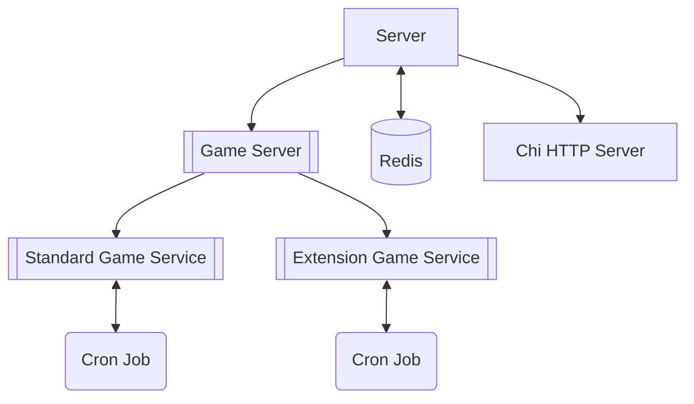
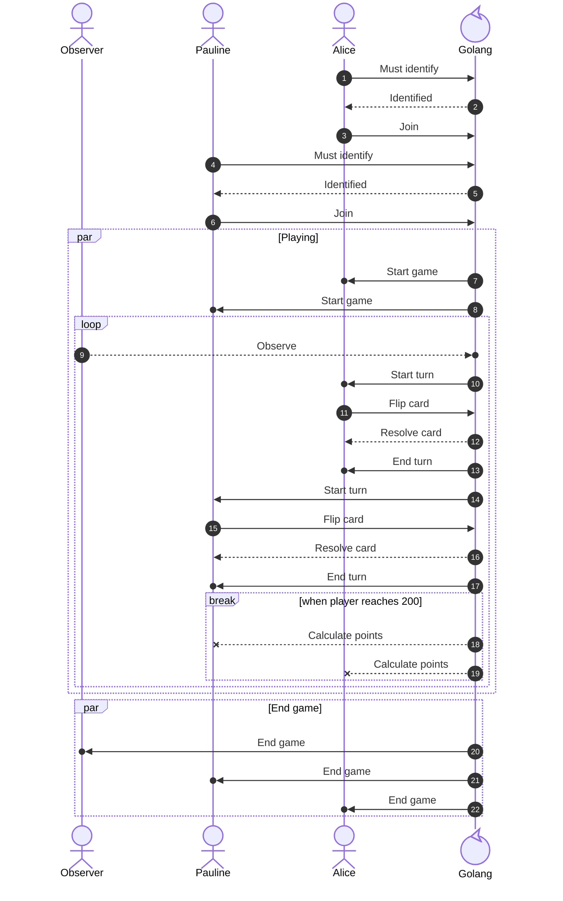

# Base Game

Use this template to create a new game service. It contains the basic structure and files needed to get started with a new game service

## Server Architecture

```mermaid
flowchart

S[Server] --> G[[Game Server]]
S <--> R[(Redis)]
S[Server] --> C[Chi HTTP Server]

G --> ST[[Standard Game Service]]
G --> EX[[Extension Game Service]]

EX <--> CR1(Cron Job)
ST <--> CR2(Cron Job)
```

## Game Flow

```mermaid
sequenceDiagram

autonumber
actor UO as Observer
actor UA as Pauline
actor U as Alice


participant G@{type: "control"} as Golang

U ->> G: Must identify
G -->> U: Identified
U ->> G: Join
UA ->> G: Must identify
G -->> UA: Identified
UA ->> G: Join

par Playing
G ->> ()U: Start game
G ->> ()UA: Start game

loop
UO -->> ()G: Observe
G ->> ()U: Start turn
U ->> G: Flip card
G -->> U: Resolve card
G ->> ()U: End turn

G ->> UA: Start turn
UA ->> G: Flip card
G -->> UA: Resolve card
G ->> ()UA: End turn

break when player reaches 200
G --x UA: Calculate points
G --x U: Calculate points
end
end
end

par End game
G ->> ()UO: End game
G ->> ()UA: End game
G ->> ()U: End game
end


```
