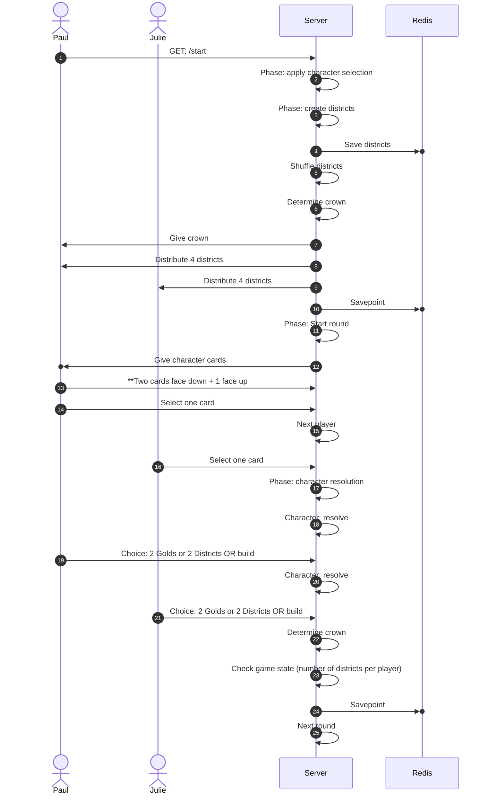

```mermaid

sequenceDiagram

autonumber

actor P1 as Paul
actor P2 as Julie

participant S as Server
participant R as Redis

P1 ->> S: GET: /start

S ->> S: Phase: apply character selection
S ->> S: Phase: create districts
S ->> ()R: Save districts
S ->> S: Shuffle districts
S ->> S: Determine crown
S ->> P1: Give crown
S ->> P1: Distribute 4 districts
S ->> P2: Distribute 4 districts
S ->> ()R: Savepoint

S ->> S: Phase: Start round

S ->> ()P1: Give character cards
P1 ->> S: **Two cards face down + 1 face up
P1 ->> S: Select one card

S ->> S: Next player
P2 ->> S: Select one card


S ->> S: Phase: character resolution

S ->> S: Character: resolve
P1 ->> S: Choice: 2 Golds or 2 Districts OR build

S ->> S: Character: resolve
P2 ->> S: Choice: 2 Golds or 2 Districts OR build

S ->> S: Determine crown
S ->> S: Check game state (number of districts per player)

S ->> ()R: Savepoint
S ->> S: Next round
```
